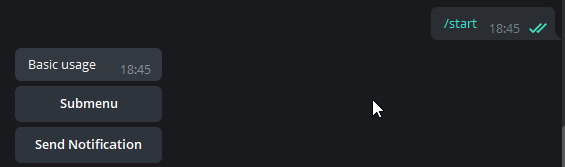

# Sent Telegram Menu
Superstructure over [telebot](https://github.com/eternnoir/pyTelegramBotAPI)  which can show inline keyboard telegram menu

## Examples
- [Basic usage](examples/basic.py) 
## Installing

Install for development: `pipenv install --dev`
